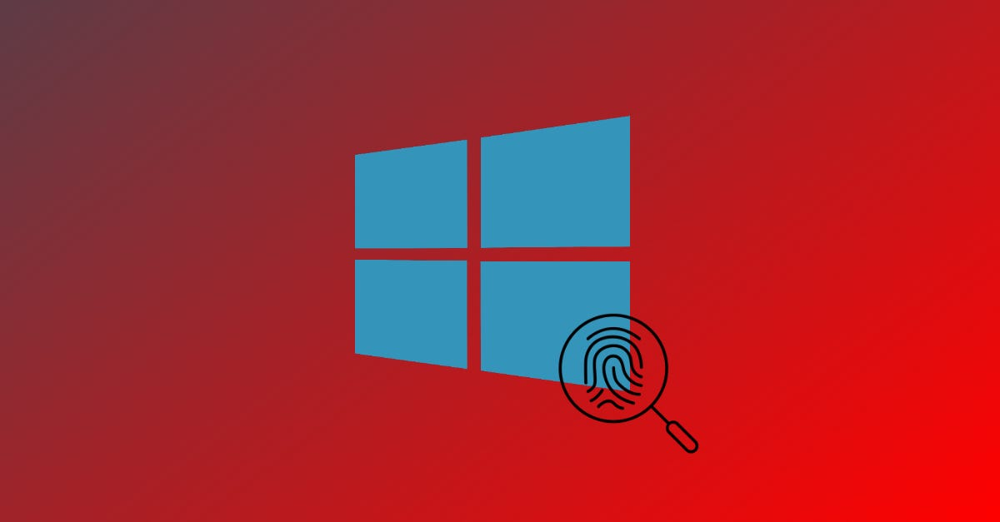

# Windows Forensics Projects

This repository contains a collection of practical projects focused on performing forensic analysis on the Windows operating system. Each project simulates real-world use cases relevant to digital forensics, incident response, and SOC investigations.

---

## Purpose
- Investigate critical Windows artifacts for forensic evidence.
- Demonstrate step-by-step methodologies for analyzing logs, registries, file systems, and browser data.
- Provide reproducible forensic workflows that can be applied in lab environments or real-world cases.
- Strengthen skills required for **DFIR (Digital Forensics & Incident Response)** professionals.

---

## Project List

### 1. Investigating Windows Event Logs for Security Incidents
**Description:** Demonstrates how to analyze Windows Event Logs to detect suspicious user and system activities.  
**Key Features:**
- Collection and interpretation of Security, System, and Application logs.
- Analysis of logon attempts, privilege escalations, and process creation events.  
**Highlights:**
- Queries for failed logons, account lockouts, and admin activities.  
- Techniques to detect lateral movement and persistence methods.  
**[View Project](project-1-investigating-windows-event-logs-for-security-incidents.md)**

---

### 2. Analyzing Windows Registry for Evidence of Malicious Activity
**Description:** Explores the Windows Registry as a forensic goldmine to extract evidence of user activity and persistence.  
**Key Features:**
- Examination of registry hives (SAM, SYSTEM, NTUSER.DAT, etc.).  
- Extraction of artifacts related to user logons, autostart programs, and system configuration.  
**Highlights:**
- Identifying persistence mechanisms and USB device history.  
- Tools: RegRipper, Registry Explorer.  
**[View Project](project-2-Analyzing-Windows-registry-for-evidences.md)**

---

### 3. Forensic Analysis of Windows File System and Artifacts
**Description:** Focuses on investigating the Windows NTFS file system and related artifacts.  
**Key Features:**
- Analysis of Master File Table (MFT), $LogFile, and $Recycle.Bin.  
- Recovery of deleted files and examination of timestamps.  
**Highlights:**
- Detecting timestomping and file manipulation.  
- Identifying hidden or suspicious files.  
**[View Project](project-3-Forensic-analysis-of-Windows-file-system-and-artifacts.md)**

---

### 4. Extracting and Interpreting Browser Artifacts on Windows
**Description:** Demonstrates how to collect and analyze browser artifacts for forensic investigations.  
**Key Features:**
- Analysis of history, cache, cookies, downloads, and saved credentials.  
- Coverage of major browsers: Chrome, Firefox, Edge.  
**Highlights:**
- Detecting visited websites, search history, and session activity.  
- Identifying evidence of phishing or exfiltration attempts.  
**[View Project](project-4-extracting-and-interpreting-browser-artifacts-on-windows.md)**

---

### 5. Recovering and Analyzing Deleted or Lost Data *(Coming Soon)*
**Description:** Covers techniques for recovering deleted or lost files in Windows systems.  
**Key Features:**
- File carving and recovery using forensic tools.  
- Reconstruction of deleted partitions and file fragments.  
**Highlights:**
- Validation of recovered evidence.  
- Practical case examples of data recovery.  
**View Project – Coming Soon**

---

## Learning Outcomes

From completing these projects, I learned:

- How to investigate **Windows Event Logs** to detect suspicious activities such as failed logons, privilege escalations, and persistence techniques.  
- The ability to analyze the **Windows Registry** to uncover evidence of user activity, system configuration, and persistence mechanisms.  
- Practical skills in conducting **file system forensics** by examining NTFS artifacts, recovering deleted files, and detecting timestomping.  
- Methods for extracting and interpreting **browser artifacts** (history, cache, cookies, downloads) to trace user web activity and identify potential evidence.  
- An understanding of **data recovery techniques** for deleted or lost files, ensuring integrity and validation of recovered evidence.  
- Hands-on experience with industry-standard forensic tools (Autopsy, FTK Imager, RegRipper, Sleuth Kit, Sysinternals, etc.).  
- The mindset of a **forensic investigator**, focusing on attention to detail, evidence preservation, and critical analysis of artifacts.  

---

## Safety and Ethics

This repository is intended for educational use only.  
All forensic techniques shown should be practiced in controlled lab environments.  
Never investigate or access systems without proper authorization.

